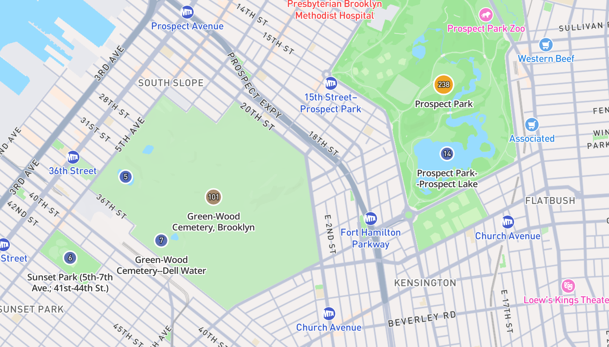
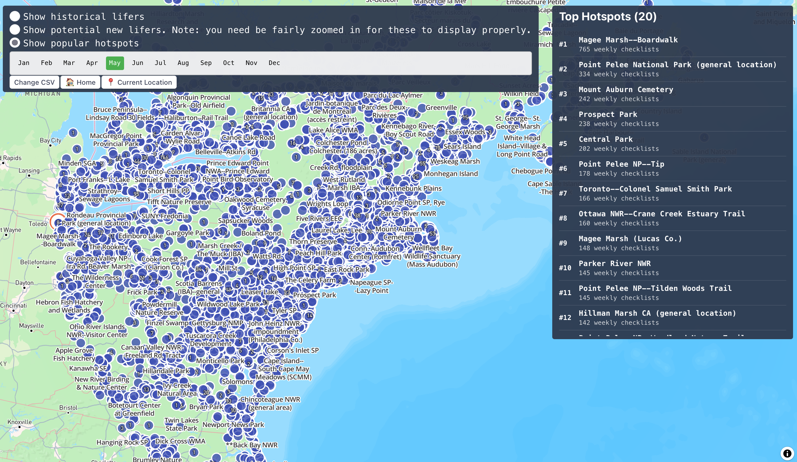

In the last part we looked at the "basics" of getting DuckDB set up with the full eBird dataset. It was slow, it used a lot of data, but we finally got to answer the real questions, like "Who's seen the most ducks?" Now, it's on to slightly more practical explorations. The goal in this post is to go from a large, still relatively unwieldy dataset, to something we can actually deploy and host on the personal site

<!-- truncate -->

# Wrangling the data

I knew from the get-go we were going to have to get very creative in how we approached pruning down the dataset here. There are two primary reasons I knew we'd have to do this. One: there was no way I was going to be able to affordably deploy 200GB of data for my personal site. If it was a for-profit tech company, deploying something like this would be an afterthought. I could get this up and running on S3 or MotherDuck in a matter of minutes. However, doing so would incur major costs, or at least costs that sound major when it's your blog and not a venture-backed startup. I set myself a goal of getting this under 10GB from the start given that was the threshold where you could meet the MotherDuck "free tier". As with many things in my programming journey, this starting principle turned out to be woefully incorrect. While they do offer up to 10 GB of storage, this only comes with a finite limit of 10 compute hours. Hopefully I wouldn't blow through that too soon, but still I'd rather not deploy this to something with a known expiration date. Deploying it to Render, the existing place where I host my site, would still be fairly easy, but there I'd be paying a fixed cost per GB, so I have a real interest to get this data down to the smallest size possible

The other big limitation I had to think through was performance. DuckDB and tools like it are great for, and explicitly built for, offline analysis. In other words, they're perfect for ad-hoc questions, but they're not as purpose-built for repeatable, online analysis like when you're offering a tool to the internet that might need to answer the same questions over and over again in, ideally, a quick manner. Thankfully, these two ends can go hand-in-hand. Reducing the size of the data will very often result in speeding up the queries themselves too.

My initial plan for getting started was to use the DuckDB data to actually produce a different database: Postgres. Postgres is extremely popular, well-documented and suited to the exact thing I was doing here. It's also trivially easy to dump data out of DuckDB into Postgres with something like this:

```sql
-- attach to a postgres DB
ATTACH 'postgresql://localhost:5432/cloaca' AS postgres_db (TYPE postgres);

-- dump a table into it
insert into public."ebird" (
  select *
  from ebd_full."full"
  where
)
```

I think if I was focusing on doing this the "right" way I would have kept going this way. But something dawned on me as I was fiddling around with DuckDB. The queries I was running on it were already seemingly fast enough for "production" use. If so, why waste all the effort to get it into Postgres? Furthermore... I use Postgres all the time and while I wouldn't mind spinning it up again, getting my tables neatly defined and honing my indexes to perfection, it just sounds more fun to see if I could just get DuckDB up and running all on its own. I haven't checked if this is remotely a good idea. It might be. It might be a standard part of the tool? The main pro I could think of was a vague notion of cost savings. DuckDB (I think) compresses data a bit better than Postgres so I'd be having to spend less on the disk usage if I went this way. There's far more cons that came to mind: it's probably slower, harder to tune, harder to run myself and won't be taking advantage of the super rich ecosystem of Postgres monitoring and maintenance tools... All in all, sounds like a bad decision future-me will regret.

## The two initial datasets

I knew there were two overall types of data sets I wanted to produce for the app out of the gate:

1. Hotspot popularity
2. Species likelihood

### Hotspot popularity:

Something I really like to see when going to a new area is simply which hotspots are more popular. Sure, it's nice to go where the popular kids are, but this is really more a valid and super easy signal to finding a good place to bird. The most popular birding spots, at least in my area, are truly really good. They're where I like to go and where I'd recommend others to go too. It's also a nice signal that a place is safe and accessible. To state the obvious: this isn't a guarantee of any of these. Some spots are just popular cause, well, they're popular. Central Park is a great example of both. It truly is a really good spot to see birds, but also, is really, really popular too.

Here's what I wrote to calculate this:

```sql
    select
        "LOCALITY ID" as locality_id,
        extract(month from "OBSERVATION DATE") as month,
        -- I think i'm doing this right here?
        count(*) / count(distinct date_trunc('week', "OBSERVATION DATE")) as avg_weekly_number_of_observations
    from
        ebd_full."full"
    where
        "OBSERVATION DATE" > current_date - interval '5 year'
    group by
        1,2
```

A few quick explanation notes: this is "grouping" all observations in the last 5 years by their Locality ID (the unique ID in eBird for a hotspot) and the month of the observation. This is basically a way of saying "how many checklists were submitted in Central Park in October for the last 5 years?". I don't exactly want that though. I think a more intuitive metric is "how many checklists typically get submitted in a week there?" A hotspot with limited popularity might only have 1 or 2 per week, something with moderate popularity between 10-50, and then something that's very popular should be 100 or above. Some quick benchmarking against the "real" data on eBird supports this to be true. In May of this year, Green-wood cemetery saw 536 checklists. That's roughly 125 per week. McGolrick Park, my local patch, is far less popular but still sees steady traffic, so it'd be moderate with 114 total checklists or 29 or so per week. Then, the more peripheral hotspots would see somewhere between 2-20 checklists per month.

A few things already stick out to me as issues here and point to the fact that you can spend a LOT of time refining metrics and queries like this. This is an exercise I absolutely love. We start these analyses out with such a rich internal model of what feels like the "true" metric here. But then getting that metric written out and working requires so much refining. One thing about the McGolrick park numbers is that it shows the under-valuing of group checklists. The McGolrick park bird club can have 200+ people in attendance in a given week. This should arguably reflect in the popularity, but it won't. Simply multiplying the checklists count by the number of observers would solve for this. Another thing is the conversion to weekly numbers. In hindsight, I probably should have gone with monthly data purely as a convenient way to test my results against eBird. However, to me the "weekly number of checklists" seems just more intuitive. Other questions: should we count checklists or number of unique observers? When I see a semi-popular hotspot, would it be confusing to realize it's just 1-2 birders' local patch? I could spend days more digging into this, but for now I should just mostly move on...

Except there are at least two glaring bugs I wrote here. In my defense I was a bit doubtful in my own comment on that line.

1: `count(*)`: this isn't counting checklists, this is counting observations! So my numbers were wayyy too high.

Oh yeah and they are. We need to count distinct checklists here instead: `count(distinct "SAMPLING EVENT IDENTIFIER")` should do the trick.

2: This is a more subtle bug but one I should know better than to do... given I've done this a million times before when writing this kind of time based average: `/ count(distinct date_trunc('week', "OBSERVATION DATE"))`. Naively, this seems right: the average is number of checklists / number of weeks. However, we're grouping by the hotspot and the month. Thus, if we're using the hotspots own data to determine the number of weeks for that month, that number might not be the actual months in that year. If that hotspot only had 1 checklist that month, then we could just be dividing 1/1. What we actually need to do is just use a constant number of weeks per month for every hotspot.

Here's the "final" query here that I ended up with. I'm gonna hedge that still since I know I'll probably find some more bugs:

```sql
with number_of_weeks_in_each_month as (
    select
        extract(month from "OBSERVATION DATE") as month,
        count(distinct date_trunc('week', "OBSERVATION DATE")) as num_weeks
    from
        ebd_full."full"
    where
        "OBSERVATION DATE" > current_date - interval '5 year'
    group by
        1
)
select
    "LOCALITY ID" as locality_id,
    extract(month from "OBSERVATION DATE") as month,
    -- I think i'm doing this right here?
    count(distinct "SAMPLING EVENT IDENTIFIER") / max(num_weeks) as avg_weekly_number_of_observations
from
    ebd_full."full"
    join number_of_weeks_in_each_month on extract(month from "OBSERVATION DATE") = month
where
    "OBSERVATION DATE" > current_date - interval '5 year'
group by
    1,2
```

`number_of_weeks_in_each_month` is still not logically perfect, but in actuality should be. I should just figure out how to generate a series here in DuckDB... but I can just throw that on the future list of things to do.

Having this, we could now "materialize" this into a more condensed dataset. By only storing the actual data we need, we'd be greatly reducing the size of the data and also the time it takes to analyze it. I used the first query here to create a table for "hotspot popularity" and then, at run time, I joined it against a separate table that tracks the actual details for a hotspot. Here's how that second table is defined:

```sql
select
    distinct LOCALITY,
    "LOCALITY ID" as locality_id,
    "LOCALITY TYPE" as locality_type,
    LATITUDE,
    LONGITUDE,
    ST_Point(LONGITUDE, LATITUDE) as geometry
from
    ebd_full."full"
where
    "OBSERVATION DATE" > current_date - interval '2 year'
    and "LOCALITY TYPE" = 'H'
    AND LATITUDE IS NOT NULL
    AND LONGITUDE IS NOT NULL
order by
    locality_id
```

There's nothing too much to comment on here. I'm only looking at the last 2 years of data to determine if a hotspot should be included (one of many steps to reduce the vast number of hotspots with little to no data in them). I'm also only considering public hotspots, not personal locations. The most interesting thing is the last column I'm selecting: `ST_Point(LATITUDE, LONGITUDE)`. As I started playing around with this data I realized one extension of DuckDB I almost certainly want to use is its spatial tooling. I've never really worked with Geo data like this before, but I knew that a very important point of optimization would be quickly determining if a hotspot was within the area I wanted to search. You can mathematically figure this out using the raw decimal data of latitude and longitude but that would be quite error-prone for me to work out myself and also probably not nearly as performant.

Turns out doing this the way I did still resulted in both issues. Starting out, I had the distance filter entirely wrong. So even when I was looking for hotspots within 5km of a point in New York, I was returning basically every hotspot on earth. This was a pain to debug but eventually turned out to be me just not realizing that I was providing 1,000 times the correct value to `ST_Distance_Sphere`. A far more subtle bug was when my query resulted in a weird, cats-eye shaped ellipsis instead of a perfect circle. I honestly never figured out what caused this and I tried numerous fixes. Claude really went out of its way to suggest incorrect answers here, telling me I needed to make custom Mercator projections to fix it. What ended up working was to swap the latitude and longitude when I created the table up above in `ST_Point`. It feels like when faced with most Geo data bugs, the first trick should always be to try swapping the latitude and longitude.

In any case, here's what I ended up with for the run-time query to analyze this data:

```sql
SELECT
    localities.locality_id,
    LOCALITY as locality_name,
    LATITUDE as latitude,
    LONGITUDE as longitude,
    avg_weekly_number_of_observations
FROM localities
JOIN hotspot_popularity ON localities.locality_id = hotspot_popularity.locality_id
WHERE locality_type = 'H'  -- Only hotspots
    AND ST_Distance_Sphere(geometry, ST_Point(?, ?)) <= ?  -- Great circle distance in meters
    AND hotspot_popularity.month = ?
    and hotspot_popularity.avg_weekly_number_of_observations >= 1
```

We're just joining my localities table against the hotspot popularity one, providing parameters for latitude, longitude, the max distance in meters and lastly the month to use. I'm also filtering out any hotspots with less than 1 avg weekly number of observations since it's just kinda weird to show 0 on the map. Note: this is something to revisit (probably really soon), or else sparsely visited areas might not have much useful to display. Bigger note: it feels like sparsely visited places are one of the hardest challenges for displaying useful information for birding.

One last note on the backend implementation: I'm also defining an `RTREE` index on these geometric points too, using the following:

```sql
CREATE INDEX idx_localities_spatial ON localities USING RTREE (geometry)
```

I experimented very briefly with defining other indexes but found that their extra size (nearly doubling the DB size), paid virtually no benefit. This was not at all scientific though and is another area for potential investigation especially if these queries end up bogging down and have some `EXPLAIN`'ing to do.

But... that's a lot of text and not a lot of showing the results. So with a quick 🥁, here's how it looks:



That looks roughly right for typical May activity in Brooklyn. Performance wise it's quite snappy too:

```bash
Executing get_popular_hotspots with lat: 40.65808990435005, lon: -73.96840797919282, radius: 10.0km, month: 5
[DuckDB Spatial] Query execution took 0.057s, returned 74 rows
[DuckDB Spatial] Result conversion took 0.000s
Time took to process the request and return response is 0.10329604148864746 sec
INFO:     127.0.0.1:51295 - "GET /v1/popular_hotspots?latitude=40.65808990435005&longitude=-73.96840797919282&radius_km=10&month=5 HTTP/1.1" 200 OK
```

I can then zoom out to the entire eastern seaboard too with similar perf:

```bash
Executing get_popular_hotspots with lat: 41.92017945145008, lon: -71.16751310883416, radius: 1000.0km, month: 5
[DuckDB Spatial] Query execution took 0.067s, returned 10138 rows
[DuckDB Spatial] Result conversion took 0.003s
Time took to process the request and return response is 0.1633131504058838 sec
INFO:     127.0.0.1:51327 - "GET /v1/popular_hotspots?latitude=41.92017945145008&longitude=-71.16751310883416&radius_km=1000&month=5 HTTP/1.1" 200 OK
```

Rendering this in an explainable way is a bit more challenging:



I'm just using my existing map plotting tools and I think they could use some adjustments here to show a less data at once, especially when zoomed all the way out. Still, it's rather cool to very quickly get a ranking of the popularity of spots at such a broad range as this!

Oh and one last note? How much space does this take? Well right now with just these tables, for the entire world, it's only a measly 466MB. That's far lower than I expected, though I really am not throwing much into at all yet. I'm more than a bit worried what will happen when I need a row for each species, for each month for each hotspot...

### Getting this live

Now, you might notice, past-writer me and present me are in a bit of conflict here. See, now I'm supposed to go ahead and move on to the species likelihood mapping. But I do have one big concern. I've sunk a few hours into this exercise thus far and while I have promising results locally, I really have no idea how this might be perform on a hosted site. So I think before we spend more time adding data, I think it might be worth pausing here to see if we can even deploy what we currently have. My rough plan is to just send the "parsed" DuckDB up to Render as an attached volume and then read it from there... but I am also starting from square 1 this arena.

Render makes this quite easy though and I can get 1GB of storage attached at < $0.25/month. Creating this took about 5 seconds and hopefully loading it with data should be just as easy since I can SCP data in from my local machine. I didn't have an SSH key added to my account yet but this also was quite easy. Honestly I have no interest to shill for Render, but kudos to them on their docs in this whole process. This can always be a pain to get right and their docs were the right level of "here's an example that's probably what you want" along with great deep links from their docs to the right place in their product.

Within 1 minute I was SCP'ing the file up to the disk:

```bash
% scp -s ~/parsed_full.db srv@ssh.oregon.render.com:/var/data
parsed_full.db    46%  207MB   4.2MB/s   00:56 ETA
```

It took longer (though not even that long), just to upload the parsed dataset than it did to get the drive working. Now I just need to tell Cloaca where to look for this data and we should be good! Thankfully I was already just reading this from an ENV variable `DUCK_DB_PATH` so as long as I provide that to the server in Render this should work... In a real deployment, we'd want to have some sort of separate environment to test something like this. But as of this writing this service has a 1:1 ratio of developers to users so it's gonna be fine if we break a few things.

Once this was deployed it was simple enough to test with a quick request to the new endpoint... and, as expected, there's a bit of trouble:

```bash
IO Error: Extension "/root/.duckdb/extensions/v1.3.2/linux_amd64/spatial.duckdb_extension" not found.
Extension "spatial" is an existing extension.
```

This is somewhat expected. While I've delivered the DB file to the server, and that server does have duckdb installed to it via the python wrapper, I can imagine there are some extra steps to actually getting it running there. With a quick google, and boy do I ever have to give the Docs teams of the world credit today, we found the exact solution: https://duckdb.org/docs/stable/clients/python/overview.html#loading-and-installing-extensions. We just need to add these two lines and we should be good:

```python
con.install_extension("spatial")
con.load_extension("spatial")
```

And trying again... it works! But it took 5 seconds. This is certainly less than ideal, but I still think it's worth getting out the door so we can learn a bit more from more production-like usage. Speaking of which...

### Using it live

As of that writing, I took an ice cream break with E. She asked for a quick demo and I started showing her the NYC area. However, we both were curious to apply this to a real-life use case. We're planning a trip in a few months to New Zealand, so I spun the globe over there to see how it looked. It was honestly so great to very easily have the entire country in the view and then to see the top 10 or so hotspots. What was even cooler was to see that at least half of them, and all the top 5 locations, were places we were planning on going! This hopefully is a good validation that the data this is showing is actually relevant for trip planning.

That said, though, this is far too slow. So let's try and make this faster.

To look into this, I'll run these queries locally and also on the Render VM. Thankfully it's pretty easy to just run DuckDB in both and compare the results from explain / analyze. Here's the initial result from the VM:

<!-- cSpell:disable -->

```
┌────────────────────────────────────────────────┐
│┌──────────────────────────────────────────────┐│
││               Total Time: 2.78s              ││
│└──────────────────────────────────────────────┘│
└────────────────────────────────────────────────┘
┌───────────────────────────┐
│           QUERY           │
└─────────────┬─────────────┘
┌─────────────┴─────────────┐
│      EXPLAIN_ANALYZE      │
│    ────────────────────   │
│           0 Rows          │
│          (0.07s)          │
└─────────────┬─────────────┘
┌─────────────┴─────────────┐
│         PROJECTION        │
│    ────────────────────   │
│__internal_decompress_strin│
│           g(#0)           │
│             #1            │
│             #2            │
│             #3            │
│             #4            │
│                           │
│          60 Rows          │
│          (0.00s)          │
└─────────────┬─────────────┘
┌─────────────┴─────────────┐
│          ORDER_BY         │
│    ────────────────────   │
│      parsed_full.main     │
│    .hotspot_popularity    │
│.avg_weekly_number_of_obser│
│        vations DESC       │
│                           │
│          60 Rows          │
│          (0.00s)          │
└─────────────┬─────────────┘
┌─────────────┴─────────────┐
│         PROJECTION        │
│    ────────────────────   │
│__internal_compress_string_│
│        uhugeint(#0)       │
│             #1            │
│             #2            │
│             #3            │
│             #4            │
│                           │
│          60 Rows          │
│          (0.00s)          │
└─────────────┬─────────────┘
┌─────────────┴─────────────┐
│         PROJECTION        │
│    ────────────────────   │
│        locality_id        │
│       locality_name       │
│          latitude         │
│         longitude         │
│avg_weekly_number_of_observ│
│           ations          │
│                           │
│          60 Rows          │
│          (0.00s)          │
└─────────────┬─────────────┘
┌─────────────┴─────────────┐
│         HASH_JOIN         │
│    ────────────────────   │
│      Join Type: INNER     │
│                           │
│        Conditions:        ├──────────────┐
│ locality_id = locality_id │              │
│                           │              │
│          60 Rows          │              │
│          (0.02s)          │              │
└─────────────┬─────────────┘              │
┌─────────────┴─────────────┐┌─────────────┴─────────────┐
│         TABLE_SCAN        ││         TABLE_SCAN        │
│    ────────────────────   ││    ────────────────────   │
│           Table:          ││     Table: localities     │
│     hotspot_popularity    ││   Type: Sequential Scan   │
│                           ││                           │
│   Type: Sequential Scan   ││        Projections:       │
│                           ││        locality_id        │
│        Projections:       ││          LOCALITY         │
│        locality_id        ││          LATITUDE         │
│avg_weekly_number_of_observ││         LONGITUDE         │
│           ations          ││                           │
│                           ││          Filters:         │
│          Filters:         ││     locality_type='H'     │
│          month=5          ││    (ST_Distance_Sphere    │
│avg_weekly_number_of_observ││  (geometry, '\x00\x00\x00 │
│        ations>=1.0        ││  \x00\x00\x00\x00\x00\x00 │
│                           ││  \x00\x00\x00\x01\x00\x00 │
│                           ││  \x00\xF46\xB5p\xC8\xF5D@ │
│                           ││ \x04\x06\xE7\x88\xB8\xCAQ │
│                           ││ \xC0'::GEOMETRY) <= 30000 │
│                           ││            .0)            │
│                           ││                           │
│         52280 Rows        ││          362 Rows         │
│          (2.45s)          ││          (0.19s)          │
└───────────────────────────┘└───────────────────────────┘
```

<!-- cspell:enable -->

Something I noticed right away is my index isn't being used! I glanced over it above, but I actually initially started off using `ST_DWithin` but stopped using it since it wasn't really what I wanted. Someone halfway proficient in Geo data could probably spot the issue and solution right away... but I'm only seeing the first half. Basically if I want to use an index I should use `ST_DWithin` but if I want accuracy I need to use `ST_Distance_Sphere`. I wonder if I could get away with using both? Use the former for an initial efficient narrowing of the points and then `ST_Distance_Sphere` to narrow that down to an actually accurate picture? I played around with this and while it sometimes was used by the query planner, most of the time DuckDB would just skip the index and default to a sequential scan. Claude seems to think I just need to define an index on the `month` of the observation and everything will be fine. I think it just thinks it's operating on a Postgres DB and is wrong. It's probably actually right and I'm ignoring it incorrectly, but let's try and John Henry this a bit longer.

DuckDB does have excellent docs across the board, so I took a glance at their docs on performance. Two things stuck out to me: 1) they really highlight the [importance of ordering here when possible](https://duckdb.org/docs/stable/guides/performance/indexing#the-effect-of-ordering-on-zonemaps). 2) They talk about the [inefficiency of joining on strings here](https://duckdb.org/docs/stable/guides/performance/schema#microbenchmark-joining-on-strings). I know we're not explicitly ordering these tables and I also know we're using strings as our IDs in most cases (Locality IDs). 1) is because I didn't think about and 2) is because the key is a string... or does it have to be? So let's try both. Let's order both tables when parsing them. And then let's try converting the hotspot ID to an integer.

### Ordering Data

For ordering... well it turns out I already was ordering the localities table but not the hotspots one. Let's see what happens there. Just saying this again, these databases are fascinating, truly. Ordering the hotspot popularity table vastly reduced the initial DB creation performance (going from a few seconds to over 2 minutes), but the DB is now nearly 1/3 the original size (250MB vs 650MB before).

Let's just replicate that on the VM to test things out by creating a quick new version of that table:

```sql
create or replace table hotspot_popularity_v2 as (
      select * from hotspot_popularity
      order by locality_id, month
  );
...
Connection to ssh.oregon.render.com closed by remote host.
Connection to ssh.oregon.render.com closed.
```

Oh no. `Ran out of memory (used over 512MB) while running your code.`

Might have to just rebuild the DB and push it back up. Thankfully it's a lot smaller now!

Unfortunately, if there was a speedup here it was a modest one. On to the IDs!

### Using integer IDs

Let's peak into the locality IDs:

<!-- cspell:disable -->

```bash
┌─────────────┐
│ locality_id │
│   varchar   │
├─────────────┤
│ L1          │
│ L10         │
│ L10000087   │
│ L1000010    │
│ L10000105   │
│ L1000013    │
│    ·        │
│    ·        │
│ L10003217   │
│ L10003228   │
│ L10003279   │
│ L10003410   │
│ L1000354    │
└─────────────┘
```

<!-- cspell:enable -->

So these should be pretty easy to just turn into integers with something like:

```sql
CAST(SUBSTRING(locality_id, 2) AS INTEGER) as locality_id_int
```

I _think_ it might be nice to only store these as integers and then be able to convert back to the string version. However, I'm not seeing an obvious pattern there in how the string version is being created. I'm sure I could finesse some sort of left-padding... or I could store both for now. We'll store both in the `localities` table and then we'll only use the integer ID in hotspots. Somehow that further reduced the DB size, now to just 165 MB? I should state at this point I am in no ways confident in my method of sizing the database...

Nor am I that confident in how I'm measuring performance. It feels like I halved the performance here again, but these queries are still taking 1-2 seconds. It's at this point that I'm starting to feel truly silly for spending more and more time trying to get an analytic database to perform like this.

### Trying other tactics

Stepping back and looking at that explain again, I'm thinking that maybe the join isn't really the expensive part. What looks to me to be more problematic is the sequence scan on the localities table:

<!-- cspell:disable -->

```bash
┌─────────────┴─────────────┐
│         TABLE_SCAN        │
│    ────────────────────   │
│           Table:          │
│     hotspot_popularity    │
│                           │
│   Type: Sequential Scan   │
│                           │
│        Projections:       │
│      locality_id_int      │
│avg_weekly_number_of_observ│
│           ations          │
│                           │
│          Filters:         │
│          month=5          │
│avg_weekly_number_of_observ│
│        ations>=1.0        │
│                           │
│         52421 Rows        │
│          (0.26s)          │
└───────────────────────────┘
```

<!-- cspell:enable -->

I would love to somehow force DuckDB to try and use the index I defined on the lat/long geometry for this table I defined with:

```sql
CREATE INDEX idx_localities_spatial ON localities USING RTREE (geometry)
```

However, I'm not seeing an easy way to force the query planner to use this index like you can in other DBs. Digging through the docs, I noticed 1 concern right away:

> One of the arguments to the spatial predicate function must be a “constant” (i.e., an expression whose result is known at query planning time). This is because the query planner needs to know the bounding box of the query region before the query itself is executed in order to use the R-tree index scan.

Oof. I don't think this would work in my query case since I'm using parameters like so:

```sql
...
AND ST_DWithin(geometry, ST_Point(?, ?), ?)
...
```

Maybe I could just do the query templating myself before hand to make this a more static query?

Playing around a bit with some simplified queries, though, I realized that even a simple, static `ST_DWithin` with a `ST_Point` wasn't using the RTREE index on either my local DB nor on the slower VM. However, if I just threw in an ST_Envelope instead suddenly the index would be used. This is surprising and confusing. It turns out that `ST_DWithin` isn't supported but `ST_Within` is... oof... More oof's ensued after this as I tried many various query patterns to try and get an index to be used when joining against the hotspot data. I found a lot of different ways to get an index to apply to a query just against `localities` (the table with the lat/long geometry on it), but nothing when a join was applied to it. I very well could have missed something, but I, and subsequently Claude, tried many different combinations of query definitions with no dice.

I did have another thought when trying out various ideas: what if I could just add the geometry data to the hotspot data. Or better yet... why even have 2 tables if really only need 1. I had started off with separate tables because of separation of concerns and whatnot, but really if I continue down the path of "only return data for a hotspot" then I might realistically can get away with only querying a single table. If I did that then the join condition might be entirely obviated and I might get better index performance?

So I created a simple, unified table... and presto:

```sql
┌────────────────────────────────────────────────┐
│┌──────────────────────────────────────────────┐│
││              Total Time: 0.0530s             ││
│└──────────────────────────────────────────────┘│
└────────────────────────────────────────────────┘
```

That's on the VM. That plan didn't even use the index nor does it seem like it even needs it!

# Conclusion

At this point, it's probably time to wrap up this rambling post. I sure did learn a lot doing this, though it's a bit difficult to sum up neatly. Here are some sundry bullet points firing around at the end:

- DuckDB is still very cool. It's super easy to get up and running, the docs are great and I was able to try things out, deploy them, adjust them live all with minimal effort.
- Using it as a production style DB is fairly silly. I'm sure I could avoided half the mistakes and rabbit holes here if I just started using Postgres sooner.
- On using Claude / AI for things like this: I don't think Claude has a great idea of how to work with DuckDB. Most of its strategies were built for relational DBs, like its tendency to just say "you need an index for this" even though DuckDB strongly recommends against using indexes for most things. Even giving it direct access to the DuckDB docs really didn't help. What it really shines at though is being a test bench of sorts for various strategies. It can write, run and analyze queries so much faster than I can. Giving it a few ideas and test strategies and then watching it go performed really nicely. Asking it to solve my problems left a bit more to be desired.
- Like with a lot of criticisms (valid or not) of AI, they also apply to humans. My instincts from the get-go were "oh this query isn't using an index, let's jump through hoops to get it to". DuckDB doesn't really tend to want to work that way, and when you're working with an analytics DB for the first time it might make sense to read the docs more.
