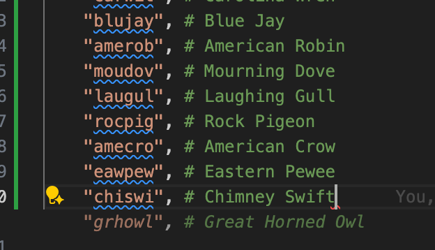

I had an idea the other day when working on some AI voice stuff... what if you could re-create the old birding hotlines but have them automatically update upon recent sightings? What would it be like to be able to call a number and hear which birds are currently being seen in an area, knowing that the information was always up to do? How feasible is this with current tooling and would it even be fun to use? Let's see!

<!-- truncate -->

## Beginnings

The other day at work I was helping a client [launch a new feature for a "real time" AI voice API](https://openai.com/index/introducing-gpt-realtime/). I was helping update their SDKs to support some new features and as part of that I needed to use some quick examples to test them out. I had never really used an "audio" forms of AI before so I honestly had no idea what was even possible here in mid 2025. I fired up one of our "push to talk" examples, and was prompted to record a prompt to the AI. As usual, my thought turned to birds, so I asked "what are some good birds to see in New York right now?" I was quite surprised when a very convincing voice replied back with some genuinely good advice about fall migrants.

I quickly moved on to polishing the examples up and getting the release out the door, but the experience stuck with me. I, like so many others no doubt, am more than a bit uncertain about our strange new future we live in. At the same time, I've also seen real, tangible ways that AI has helped speed up my work or just get rid of hassles or blockers (like setting up the frontend for half of this site). So I got to thinking, how could I use this voice stuff when it comes to birding?

### Backstory on birding hotlines

I'm honestly not the best person to explain these. They predated my time in birding by probably 2 decades. However, I've heard them detailed in more than a few birding stories or memoirs so I have a good idea of how they came about and how they worked. Back around the 1970's when listing and Big Years really started taking off, one of the biggest enablers of those were the ability to get more and more up to date information about where rare birds might be. As birders started tearing across the country to try and see more and more birds, it became quite helpful to answer questions like "What rare birds are in Florida today?" or "Is the Amur Stonechat continuing in Texas right now?" I believe answering this first was possible as more birders came to know each other and would just call around to their friends or network to find out information. As the field grew though, I imagine it got more than a bit annoying (and expensive) to always be "on call" for a location or a rarity. Thus, the hotlines were born. Once a day or so, an area's birding club or society would record a message about the day's rarities:

> The Hudsonian Godwit found by Leo continues on Jamaica Bay's East Pond today. Additionally a Wilson's Phalarope was reported just west of there at Floyd Bennet field. The Red-footed Booby first found by Tim has not been seen since Tuesday morning

Not only was this helpful for Big Year birders, who might be trying to make the call of diverting a route to pick up another species, but it was also useful for local birders too to stay up to date with their local rarities.

These hotlines continued for quite a while, up until the 2000's when they began to be replaced by quicker and more easily distributed communication methods. Email list-serves required much less effort to update, and then even more-so once larger messaging platforms like Whatsapp, GroupMe and now Discord entered the picture. eBird itself also has become instrumental in helping track and find rare birds. You can set up email alerts for rare birds across the world and with a few clicks check and see just when the last reporting of a rare species was.

All in all, this progression has been a great one for basically everyone involved. If you're a lister or working on a Big Year it's never been quicker nor easier to track the status of a rare bird whether it's in your local patch or halfway around the world. I imagine the only person's job that might've gotten difficult is the moderators of these communication mediums. There are countless more birders today and there are bound to be a few mistakes (just like a rare Cuckoo in my patch yesterday seemed to morph into a Blue Jay once I had better viewing conditions). I'm sure the moderators of yore had to deal with this in their capacity too, though maybe it was over a panicked phone call rather than a spurious Discord post.

So why go back down the path of a hotline? There's virtually no reason in practical terms. But, there's just something quaint and nice to me about potentially being able to call in to my local patch to hear what's been going on. Additionally, I imagine a big reason these hotlines fell away is that it was just too much work to record a new update every day, much less every few minutes when a new observation comes in. Today, though, that work might be largely mitigated by what's been coming out with the latest technology. And, I'm really genuinely curious to see if an outdated form of technology might have a second chance when it's paired with the newest of technology we have today

## Making this work

Like always, I'd like to start simple before going too far with this idea. I'd like to only work with one place first, my local patch McGolrick Park. I'd love to stick with this first cause I'm going to have a deep sense of what kind of updates and contents would resonate the most with our birders here. I'd like to run this at some sort of regular cadence. Maybe I'll try hourly to start before seeing if I should make that more frequent, or even experiment with having it update in real time? Fetching this data should be pretty straightforward. I can just ask the eBird API for the observations in the park from the last day. I can also ask for any rarities too (those these are very rare in this park). From that, I think then I can send this over to an LLM to have it do two things: first, turn the raw observational data into a human readable (or really, hearable) form. Then, I can use its text-to-speech capabilities to convert that into audio. I'm arguably thinking about this wrong, since both of those steps will probably just happen in one call. Last, I'll just need to get that recording into a place where Twilio or some other phone provider can pick it up and play it over a "recorded line" of sorts. This last part, the phone bits, is funnily enough the part I'm least familiar with.

### Fetching the data.

Let's start with the data. Qualitatively, what I'm looking for here is something like:

- first, and most importantly, are there any rare birds in the park?
- overall, which bird species are being seen right now?
- if something interesting is here, did it just show up or has it been here?
- if we can know, where specifically is it in the park? (hello helpful comments!)
- also, who saw the bird? Can we give them credit?

I think roughly we'll want to make a few calls to the eBird API:

- bird species over the last few days in the hotspot
- rare bird species in the last few days in the hotspot

And maybe that's it? I might have to make a few follow up calls if I want to see the history of a bird over time (to say something like "The Cerulean Warbler first found by P continues in the Magic Bushes" [what a dream if it did]). But let's walk before we run.

Given I already have the eBird API set up nicely as a Python SDK, getting this up and going is pretty easy:

```python
async def fetch_observations_for_regions_from_phoebe(
    region_code: str,
) -> list[PhoebeObservation]:
    return await get_phoebe_client().data.observations.recent.list(
        back=7,
        cat="species",
        hotspot=True,
        region_code=region_code,
        include_provisional=True,
    )


async def fetch_notable_observations_for_area_from_phoebe(
    region_code: str,
) -> list[PhoebeObservation]:
    return await get_phoebe_client().data.observations.recent.notable.list(
        back=7,
        hotspot=True,
        region_code=region_code,
    )


async def run_bird_calls_job(region_code: str):
    species_observations = await fetch_observations_for_regions_from_phoebe(region_code)
    print(f"Fetched {len(species_observations)} observations")
    species_found = {obs.species_code for obs in species_observations}
    print(f"Found these species codes: {species_found}")

    notable_observations = await fetch_notable_observations_for_area_from_phoebe(
        region_code
    )
    print(f"Fetched {len(notable_observations)} notable observations")

    if notable_observations:
        notable_species_found = {obs.species_code for obs in notable_observations}
        print(f"Found these notable species codes: {notable_species_found}")
```

Running that produces some pretty useful results!

<!-- cSpell:disable -->

```bash
% uv run src/cloaca/api/bird_calls/main.py
Fetched 30 observations
Found these species codes: {'grcfly', 'bawwar', 'amered', 'eursta', 'dowwoo', 'chswar', 'amerob', 'amecro', 'rthhum', 'laugul', 'veery', 'scatan', 'amhgul1', 'chiswi', 'norcar', 'eawpew', 'rethaw', 'houspa', 'camwar', 'yelwar', 'norwat', 'norpar', 'magwar', 'yebcuc', 'rocpig', 'comyel', 'blujay', 'olsfly', 'comgra', 'moudov'}
Fetched 0 notable observations
```

The 0 notable observations is expected, so let's swap over to Jamaica Bay's East Pond to make sure that part of the query is working:

```bash
% uv run src/cloaca/api/bird_calls/main.py
Fetched 101 observations
Found these species codes: {'comyel', 'merlin', 'cangoo', 'dowwoo', 'gbbgul', 'bkbplo', 'comter', 'snoegr', 'lessca', 'mallar3', 'eursta', 'mutswa', 'blkski', 'rewbla', 'wilpha', 'bubsan', 'leasan', 'fiscro', 'lobdow', 'pecsan', 'baleag', 'carwre', 'semplo', 'stisan', 'greegr', 'whrsan', 'bcnher', 'rudduc', 'norwat', 'sposan', 'rocpig', 'grycat', 'osprey', 'swaspa', 'buwtea', 'houspa', 'forter', 'willet1', 'buggna', 'amewig', 'amerob', 'marwre', 'amgplo', 'balori', 'barswa', 'margod', 'amecro', 'amhgul1', 'sonspa', 'amwpel', 'cedwax', 'laugul', 'hudgod', 'brnthr', 'norhar2', 'amered', 'gloibi', 'norcar', 'shbdow', 'treswa', 'houwre', 'ribgul', 'sora', 'amekes', 'renpha', 'normoc', 'norsho', 'pibgre', 'moudov', 'lesyel', 'gadwal', 'btbwar', 'whevir', 'gresca', 'caster1', 'rebwoo', 'botgra', 'wessan', 'amegfi', 'purmar', 'gnwtea', 'perfal', 'doccor', 'rethaw', 'royter1', 'grbher3', 'easpho', 'norfli', 'coohaw', 'greyel', 'wooduc', 'ambduc', 'yelwar', 'houfin', 'ycnher', 'redkno', 'ameoys', 'easkin', 'killde', 'comgra', 'semsan'}
Fetched 88 notable observations
Found these notable species codes: {'lessca', 'wessan', 'purmar', 'amwpel', 'margod', 'wilpha', 'caster1', 'hudgod', 'bubsan', 'sora'}
```

<!-- cSpell:enable -->

Looks like it is (and also I really need to get back over there!).

Let's do some quick and dirty filtering on the McGolrick data though to remove our most common species (I don't think anyone's calling in to hear what the Starlings are up to). I can mostly manually figure these out, though it's funny when Copilot tries to help...



Something interesting I noticed right away... someone noticed a Yellow-billed Cuckoo this morning! Maybe that darn Blue Jay turned back... But, for McGolrick, this and the Olive-sided Flycatcher are genuine patch rarities. We get 1-2 of these per year, so I'd like to flag these as rare. Unfortunately, I think I'd have to use the EBD to do that... but fortunately, I already have that loaded up and working so it shouldn't be too difficult to add?

Before embarking on that and probably ending up writing another new blog post about just that, I'd like to proceed a bit further with trying and proving out that idea.

### Human hearable reports

For this next part we need to take this data and get it into the LLM to make it something more human appealing. Let's try and turn this into a form that an LLM like ChatGPT can use. One though I'm toying with is giving the LLM a "tier" of possible birds like so:

- rarities: genuinely rare birds that would show up on eBird's rarity reports
- patch_rarities: birds that are rare for the park (like the Cuckoo or Flycatcher today)
- patch_favorites: birds that aren't as rare, but everyone loves to see when they show up (warblers, tanagers, etc.) For now I'll just let this be anything that isn't one of the prior tiers and isn't a common bird.

So maybe I can define that in a dataclass like so:

```python
class BirdRarityTier(enum.Enum):
    # genuinely rare birds that would show up on eBird's rarity reports
    RARITY = "rarity"
    # birds that are rare for the park (like the Cuckoo or Flycatcher today)
    PATCH_RARITY = "patch_rarity"
    # birds that aren't as rare, but everyone loves to see when they show up (warblers, tanagers, etc.)
    PATCH_FAVORITE = "patch_favorite"
    # the rest
    COMMON = "common"


class PatchObservation:
    common_name: str
    date_last_seen: str
    taxonomic_order: int
    scientific_name: str
    species_code: str
    rarity_tier: BirdRarityTier
```

Then we can just convert our two API responses into this form. I can't actually distinguish patch_rarities just yet, but that'll come shortly. Here's a sample of this data for Jamaica Bay:

<!-- cSpell:disable -->

```bash
+----------------+-----------------------------+------------------+
| patch_favorite | Osprey                      | 2025-09-06 10:11 |
+----------------+-----------------------------+------------------+
| patch_favorite | Gray Catbird                | 2025-09-06 10:11 |
+----------------+-----------------------------+------------------+
| patch_favorite | Northern Waterthrush        | 2025-09-06 10:11 |
+----------------+-----------------------------+------------------+
| rarity         | Marbled Godwit              | 2025-08-31 09:30 |
+----------------+-----------------------------+------------------+
| rarity         | Caspian Tern                | 2025-08-31 09:30 |
+----------------+-----------------------------+------------------+
| rarity         | American White Pelican      | 2025-08-31 09:30 |
+----------------+-----------------------------+------------------+
| rarity         | Purple Martin               | 2025-08-31 09:30 |
...
```

<!-- cSpell:enable -->

(of course I haven't set up common birds for Jamaica Bay, hence why an Osprey is there)

This is just about there! All that's left is a prompt to tell the LLM how to report this. I'm in no ways talented at writing these, but let's take a first stab:

```
You are a rare bird alert hotline that Birders will call into to hear about rare, notable or interesting birds at a Hotspot. The hotspot name and the list of birds will be provided to you in this input. Your job is to turn that list of birds into a brief summary of the birds at the hotspot today. You always want to focus on reporting `rarity` level birds first, then `patch_rarity`'s, followed by `patch_favorites`. Prioritize birds that have been seen the most recently too. Don't report anything that hasn't been seen in the last 3 days.


Here's an example input:
<!-- cSpell:disable -->
\`\`\`
Hotspot: McGolrick Park

+----------------+---------------------------+------------------+
| Rarity         | Common Name               | Last Seen        |
+================+===========================+==================+
| patch_favorite | Baltimore Oriole          | 2025-08-30 18:25 |
+----------------+---------------------------+------------------+
| patch_favorite | Ovenbird                  | 2025-08-30 18:25 |
+----------------+---------------------------+------------------+
| patch_favorite | Black-and-white Warbler   | 2025-09-01 07:00 |
+----------------+---------------------------+------------------+
| patch_favorite | Chestnut-sided Warbler    | 2025-09-01 07:00 |
+----------------+---------------------------+------------------+
| patch_favorite | Scarlet Tanager           | 2025-09-01 07:00 |
+----------------+---------------------------+------------------+
| patch_favorite | Great Crested Flycatcher  | 2025-09-02 06:30 |
+----------------+---------------------------+------------------+
| patch_favorite | Common Yellowthroat       | 2025-09-02 06:30 |
+----------------+---------------------------+------------------+
| patch_favorite | Magnolia Warbler          | 2025-09-02 06:30 |
+----------------+---------------------------+------------------+
| patch_favorite | Ruby-throated Hummingbird | 2025-09-03 06:30 |
+----------------+---------------------------+------------------+
| patch_favorite | Yellow Warbler            | 2025-09-06 07:55 |
+----------------+---------------------------+------------------+
| patch_favorite | Northern Parula           | 2025-09-06 09:52 |
+----------------+---------------------------+------------------+
| patch_favorite | American Redstart         | 2025-09-06 10:37 |
+----------------+---------------------------+------------------+
| patch_favorite | Northern Waterthrush      | 2025-09-06 11:08 |
+----------------+---------------------------+------------------+
| patch_favorite | Cape May Warbler          | 2025-09-06 11:08 |
+----------------+---------------------------+------------------+
| patch_rarity   | Olive-sided Flycatcher    | 2025-09-05 18:26 |
+----------------+---------------------------+------------------+
| patch_rarity   | Yellow-billed Cuckoo      | 2025-09-06 11:08 |
+----------------+---------------------------+------------------+
\`\`\`
<!-- cSpell:enable -->

And here's an example of how you would report this

> Thanks for calling McGolrick Park rare bird alert. A Yellow-Billed cuckoo was seen starting this morning. Yesterday, an Olive-sided flycatcher was seen. For the warbler lovers, Yellow Warblers, Redstarts, Northern Waterthrushes, Cape Mays and Northern Parulas are all being seen. Happy birding!

```

That's probably woefully insufficient, but let's try it! It's funny how I spend all day working with OpenAI's SDKs yet I still failed to get this working the first time...

```
Hey there! Looks like McGolrick Park is buzzing with bird activity right now! We’ve got some real gems spotted recently. Just today, you’ve had sightings of the Northern Parula, American Redstart, Northern Waterthrush, Cape May Warbler, and even the Yellow Warbler.

And check this out—there’s a rare visitor: the Yellow-billed Cuckoo was spotted today, too! Plus, yesterday you had an Olive-sided Flycatcher—another rare one in the area. If you head over to the park now, you might still catch those patch favorites like the Ruby-throated Hummingbird, Scarlet Tanager, and Magnolia Warbler, all seen just in the last few days.

It’s prime time for birding out there. Grab your binoculars and happy birdwatching!
Wow! McGolrick Park is a birding hotspot right now! Let me give you the highlights in a fun rundown.

First off, some of the favorite feathered friends that have shown up recently include the Yellow Warbler, Northern Parula, and American Redstart—all seen today. These warblers are in peak migration mode, so now’s a fantastic time to spot them. Plus, you’ve got the Northern Waterthrush and Cape May Warbler sighted today too—talk about a warbler bonanza!

Then, looking at yesterday, you had the Common Grackle pop up, and earlier this week, the Magnolia Warbler and Great Crested Flycatcher were around, along with that dazzling Scarlet Tanager.

But here’s where it gets really exciting: we’ve got a couple of rarities on the list! Just yesterday, an Olive-sided Flycatcher was seen, and today—drumroll please—a Yellow-billed Cuckoo made an appearance. That’s a rare bird for the area and a real treat if you can catch a glimpse.

So, if you’re heading out to McGolrick Park, bring those binoculars and keep your eyes peeled. You’ve got a great mix of patch favorites and some special visitors right in the heart of migration season. Happy birding!
Alright, let’s break it down! McGolrick Park is absolutely alive with birds right now. Here’s the quick scoop.

We’ve got some super fresh sightings today—September 6th. The Yellow Warbler showed up early in the morning at 7:55. Then, the Northern Parula swooped in around 9:52. Not long after, the American Redstart popped up at 10:37. And get this—just a bit later, at 11:08, someone spotted both a Northern Waterthrush and a Cape May Warbler. That’s a warbler party!

And for the rare birds? Today’s jackpot: the Yellow-billed Cuckoo was seen at 11:08 as well. That’s a big one. Plus, just yesterday—September 5th—an Olive-sided Flycatcher was spotted around 6:26 in the evening. Those are some rare treats for the park!
```

And so on... it was just running in a loop. And that's entirely my fault cause I copied the example for "push to talk" including the `while True` infinite loop: 🤦‍♂️.

```python
openai = AsyncOpenAI()
async with openai.realtime.connect(
    model="gpt-realtime",
) as connection:
    await connection.session.update(
        session={
            "output_modalities": ["text"],
            "model": "gpt-realtime",
            "type": "realtime",
        }
    )
    while True:
        await connection.conversation.item.create(
            item={
                "type": "message",
                "role": "user",
                "content": [{"type": "input_text", "text": user_prompt}],
            }
        )
        await connection.response.create()
        async for event in connection:
            if event.type == "response.output_text.delta":
                print(event.delta, flush=True, end="")
            elif event.type == "response.output_text.done":
                print()
            elif event.type == "response.done":
                break
```

Also that's not really the way we want this hotline to sound like... oh right, I forgot to to provide a system prompt! Adding that in and...

```
Thanks for calling the McGolrick Park rare bird alert. The standout sighting today is a Yellow-billed Cuckoo, seen this morning. Also notable, an Olive-sided Flycatcher was spotted yesterday. Warbler enthusiasts will be thrilled: Northern Parula, American Redstart, Northern Waterthrush, Cape May Warbler, and Yellow Warbler have all been seen today. Other favorites recently spotted include a Common Grackle, Ruby-throated Hummingbird, and Veery. Happy birding!
```

Hey that's pretty good! I have this just outputting as text for now, so let's add audio too. Getting the audio output added was simple: I just needed to add `audio` as an `output_modalities` and also process the `output_audio` events. Getting this into an audio file was slightly trickier but still pretty straightforward:

<!-- cSpell:disable -->

```python
def save_pcm_audio_chunks(pcm_bytes_array):
    print(f"Received {len(pcm_bytes_array)} audio chunks")
    # Open WAV file for writing
    with wave.open("bird_report_audio.wav", "wb") as wav_file:
        # Set WAV parameters
        wav_file.setnchannels(1)  # mono
        wav_file.setsampwidth(2)  # 2 bytes per sample (16-bit)
        wav_file.setframerate(24000)  # sample rate

        # Write PCM data
        wav_file.writeframes(b"".join(pcm_bytes_array))
```

<!-- cSpell:enable -->

And...

<audio controls>
  <source
    src={require('../static/audio/bird_report_audio_v1.wav').default}
    type="audio/wav"
  />
  Your browser does not support the audio element.
</audio>

It works! Though why is our fairly obnoxious response back. One thing I noticed when playing around with the various voice options though is that they're heavily scripting out things like tone, affect and emotion. Life goals honestly:

<!-- cSpell:disable -->

```
Affect: Deep, commanding, and slightly dramatic, with an archaic and reverent quality that reflects the grandeur of Olde English storytelling.
```

<!-- cSpell:enable -->

I added some extra input like so:

```
    Affect: deep, informed, wise.

    Tone: informative, terse and to the point.

    Emotion: dry, direct, concise.

    Pronunciation: articulate with a slight twang of a Southern US accent.
```

Unfortunately, this seemed to have no effect. I eventually realized that this seems to be a bug when providing both text & audio as the output modality. I mistakenly thought this was necessary to get a transcript... but turns out I just need audio. Once I provided that, we had something much better to work with!

```
Thanks for calling McGolrick Park rare bird alert. A Yellow-billed Cuckoo was seen late this morning. Yesterday, an Olive-sided Flycatcher was spotted. Today’s patch favorites include Northern Waterthrush, Cape May Warbler, American Redstart, Northern Parula, and Yellow Warbler. Happy birding.
```

This is possibly too formulaic, but let's go with it for now.

### Getting this in the phones

Okay, we've got an audio file now we can work with. All that's needed is for us to shove this into a phone call! Initially, I thought I might explore a solution where I just upload the file to something periodically. However, doing a bit more research (like 15 seconds more), maybe I'll just have Twilio read the audio data from an API. This is maybe slightly more work, but also opens the door up to have this data updated in "real time" whenever someone calls. Poking around, I really think what I want is whatever this [TwiML](https://www.twilio.com/docs/voice/twiml) thing is called... maybe this will let me eventually set up some sort of dynamic phone tree even?

Seems like the main thing I need to do now is to set up a new API endpoint that returns their custom XML stuff:

```python
async def get_bird_call(location_code: str | None) -> str:
    if location_code is None:
        location_code = MC_GOLRICK_PARK_HOTSPOT_ID

    response = VoiceResponse()
    response.say("Hello you're talking to Bird!")

    return str(response)
```

And... that works:

```
"<?xml version=\"1.0\" encoding=\"UTF-8\"?><Response><Say>Hello you're talking to Bird!</Say></Response>"
```

Now we just need to map that to the audio file itself. I'm not sure exactly the _best_ way to host a file like this, but for now I can just push the file up to the server and then read it from there. In some ideal world I guess this would live on a service like S3 better suited for serving data. But, this will do for now:

```python
@Cloaca_App.get("/v1/bird_calls/audio_file")
async def get_bird_call_audio_file(location_code: str | None):
    try:
        audio_files_path = os.environ["AUDIO_FILES_PATH"]
    except KeyError:
        raise RuntimeError(
            "AUDIO_FILES_PATH environment variable is required. "
            "Please set it to the path of your audio files."
        )
    file_path = f"{audio_files_path}/{location_code}.wav"
    print(f"Looking for audio file at {file_path}")
    if os.path.exists(file_path):
        return FileResponse(file_path, media_type="audio/wav")
    else:
        return {"message": "Audio file not found"}, 404
```

From here, the main work was just going through some extra steps in Twilio to set up a phone number. Then, I simply routed that phone number to an ngrok-forwarded URL to my local machine and... 🥁🥁🥁

It works! I can't really show a great demo of this given you can't record the audio of a phone call in a screen recording on iOS, but it really does work!

### Polishing this up

Alright, now on to the final step of getting this working for real. There are a few things we need to finish up. First, we need the alert to run periodically. Then, we need to make sure the file is getting persisted in the right place. Last, we need to wire this all up correctly in Twilio to not be using ngrok for this.

One forgotten API key, one mis-formatted URL, one forgotten deploy and one long session debugging why Twilio didn't like my Content-Type later... and it's live! You can now call 9148637717 and get some local bird intel!

This was quite fun and quick. It could've been quicker if it were simpler to just pass audio straight back to Twilio. All in all, this was pretty straightforward and painless though.

If you want to see the full details of this, I merged in the Pull Request for it here:

https://github.com/birds-eye-app/cloaca/pull/8

I think it'd be fun in the future to possibly extend this further:

- Certainly adding more supported hotspots. It'd be nice to add a feature to type in or even just say the hotspot you want to see information for.
- I also need to actually add in the DuckDB information to more accurately show patch rarities.
- I'd love to figure out a way to access who submitted the observation. These hotlines love giving credit to who found the bird and it'd be cool to replicate that. I get why eBird might be a bit stingy on handing user details out though.
- Similarly, I wish I could access the species comments on these too. It'd be very nice to include that so people could know where to look: "A Scarlet Tanager is being seen above the playground".
- It might be cool to eventually support some more true real time voice stuff, enabling someone to talk over the phone?
